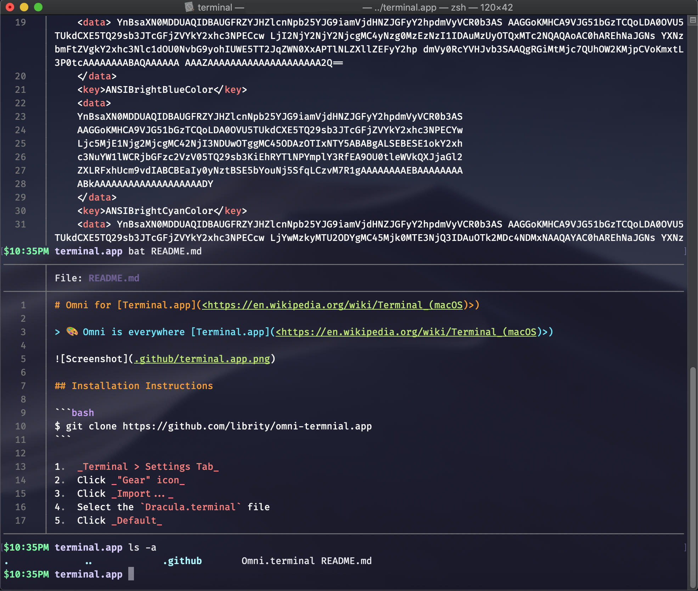

# Omni for [Terminal.app](<https://en.wikipedia.org/wiki/Terminal_(macOS)>)

> 🎨 Omni is everywhere [Terminal.app](<https://en.wikipedia.org/wiki/Terminal_(macOS)>)



## Installation Instructions

1. Clone the repo locally:

```bash
$ git clone https://github.com/librity/omni-termnial.app
```

2. Open Terminal.app and navigate to `Terminal -> Preferences -> Profiles`
3. Click on the _"Gear"_ icon and select `Import...`
4. Navigate inside the repo and open `Omni.terminal`
5. Highlight `Omni`, then click on `Default`
